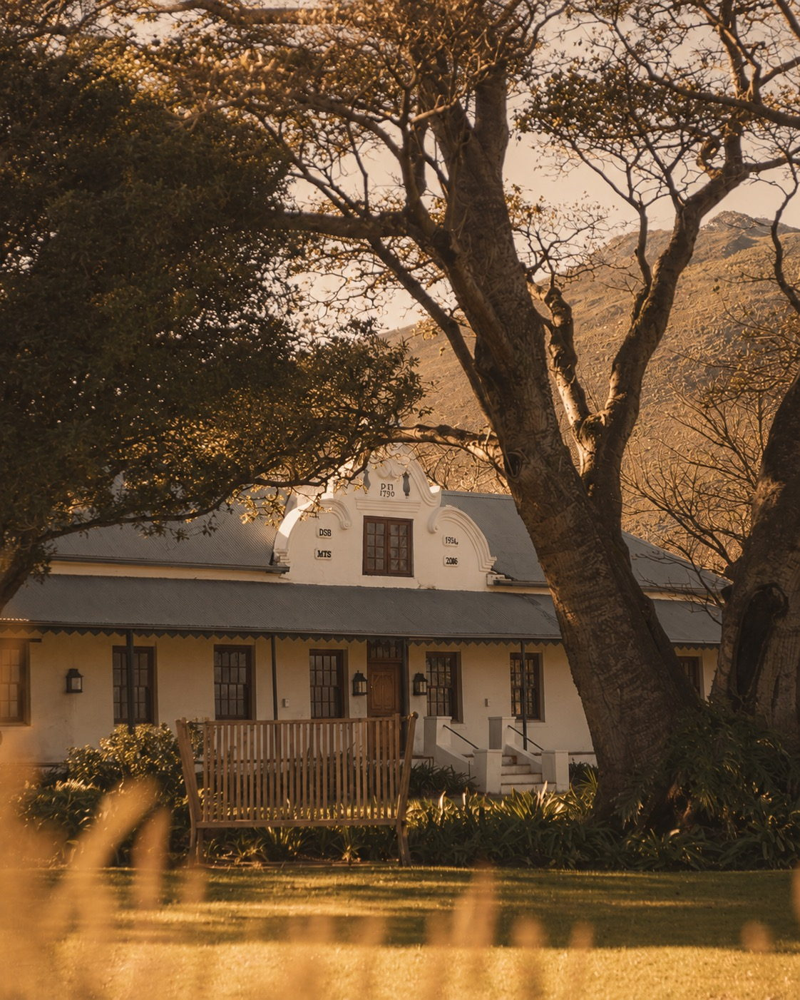

# Unscripted Travel

Static site. No build step — open `index.html`, or deploy the folder as-is.

## Before launch — what still needs real content

| Where | What to replace |
|---|---|
| `assets/` | Nothing — all seven photographs are in. |
| "In their words" section | The placeholder quote and attribution — currently marked `placeholder` on purpose. |
| Footer | `hello@unscriptedtravel.co.za`, `+27 00 000 0000`, Instagram and WhatsApp links. |
| `FORM_ENDPOINT` in the script | Enquiry destination. **Left empty it falls back to opening a pre-filled email**, so the form works either way. |

## Swapping a photograph

Replace the placeholder div with an image; the frame, ratio and caption stay as they are:

```html
<!-- before -->
<div class="plate"><p class="plate__fpo">The Winelands<br>4:5 · portrait</p></div>

<!-- after -->
<div class="plate"></div>
```

All seven are in. Still missing: **`assets/og.jpg`, 1200×630** — `og:image` is a
relative path, so link previews render with no image at all.

### The photographs

Supplied as Cloudinary originals and cut to ratio here. Two arrived at the exact
ratio; the rest were cropped, anchored so the subject survives rather than
centred blindly.

| Plate | Output | From | Crop |
|---|---|---|---|
| Table Mountain | 1672×941 (16:9) | 1672×941 | none — already 16:9 |
| The Winelands | 1122×1402 (4:5) | 1122×1402 | none — already 4:5 |
| The Peninsula | 1023×1279 | 1023×1537 | vertical .78 — trims sky, keeps the spine |
| Bo-Kaap | 1003×1254 | 1254×1254 | horizontal, centred in its arch |
| Simon's Town | 1023×1279 | 1023×1537 | vertical .35 — trims empty tarmac, keeps the ridge |
| Kirstenbosch | 819×1024 | 1536×1024 | horizontal .46 — landscape to portrait, keeps the walkway sweep |
| The Seaboard | 1023×1279 | 1023×1537 | vertical .24 — trims foreground scrub, keeps the bay |

All seven are q82 progressive JPEG, 1.8MB together, and every one sits below the
fold, so they carry `loading="lazy"` and none of them touches first paint.
Portraits are sized for a 3× phone (~1050px), the largest they are ever drawn.

**The lead caption changed.** It read "Up the back path, before the cable car
opens", which described a hiker's-eye view. The photograph supplied is the view
from across the bay, so the caption now reads "Across the bay at sunrise, before
the wind comes up." If the back-path shot turns up later, revert the line with it.

## Hero assets

Cut from the client's two cover photographs by `tools/build-hero.py`, then
flattened by `tools/flatten-kraft.py`. The masters live in
`~/Desktop/Clients 🔒/Unscripted Travel/` and are not committed; pass a path as
the first argument if they move.

- `booklet-wide.jpg` — 2600×1122, desktop. Paper extended left/right so the
  sheet bleeds full width.
- `booklet-tight.jpg` — 1199×1332, mobile (≤700px). Cropped close to the book.
- `cover-penguin.jpg` — 1025×800, the alternate cover only.
- `kraft-tile.jpg` — 400×400, the seamless sheet the hero stage fills with.

The photograph carries the wordmark, so there is deliberately no headline typed
over it.

### Flattening the kraft

The booklet was shot on kraft under a lamp, so the sheet carries a
top-to-bottom lighting grade — its top edge and its foot differ by more than a
dozen levels. That is invisible while the photograph is the whole hero, but the
pinned stage is taller than the photograph and shows fill above and below it,
and no flat colour can meet both edges at once: one of the two joins always
reads as a band across the stage.

`tools/flatten-kraft.py` fits a quadratic lighting field to the clean paper —
the book and the area its shadow falls into are excluded — and divides it out,
then scales the result back to the sheet's own mean colour. Clean paper lands
on one flat kraft; the shadow, being a ratio below the field, keeps its
falloff. The book itself is untouched. After it runs the two edges differ by
1.6 levels (wide) and 2.2 (tight), down from thirteen.

Three things follow from it, and the script prints all of them:

- **Both crops are normalised to one tone**, not to each of their own means.
  They are different regions of the same sheet at slightly different exposures,
  so per-crop means would leave the two breakpoints on visibly different browns
  and need a `--kraft` each. That shared tone is `--kraft`.
- **The mirror-tiled extension is cut off.** Earlier builds grew each crop
  downward by mirror-tiling its bottom margin, which left a visible seam and a
  smeared band across the lower third. The stage fill covers that area now, so
  the tiling is gone and the crops end where the photograph does.
- **The fill is the sheet, not a colour.** Matching the tone alone still read as
  a panel — flat fill measured std 0.7 against the photograph's 3.4 — so a
  clean patch is mirrored into a seamless tile and drawn at the same scale the
  grain has inside the photograph. Because each crop is laid out full-bleed
  that scale is a fraction of the viewport: `30.7692vw` for the wide crop,
  `66.7223vw` for the tight one.

If you change the crops, re-run it and paste the tone and the two sizes it
prints into `:root` and `.hero__stage` in `index.html`.

### Scrolling into the site

The hero is a 170vh section with a pinned stage. Scrolling through it scales the book slightly and fades it into the white page, so reaching the content reads as a continuation rather than a cut. Transform and opacity only, written once per frame from a rAF.

Without JavaScript the hero collapses to a normal 100vh block and everything stays visible; the tall height is gated behind the `.js` class.


### The cursor-driven cover wipe

Moving the pointer across the booklet wipes the penguin cover in from the left, with the soft mask edge sitting **under the cursor** — it is scrubbed, not toggled. Entering eases from rest to wherever the cursor is, then it tracks directly; leaving eases back. On touch, drag across the book to scrub (`touch-action: pan-y` keeps vertical scrolling intact).

The alternate shot was taken at a different distance, so the build script scales it until its book lands exactly on the base book's bounding box, matches exposure (the two shots share a white balance and differ by 10% brightness), and exports **only the book**. Kraft, spine and shadow always come from the base crop, so the two states differ by nothing except the printed cover — verified by diffing the rendered states, which changes nothing outside the cover rectangle.

The overlay is positioned by percentages derived from the same geometry the crops are built with; `build-hero.py` prints them on every run. If you change `BOOK`, `WIDE_W`, `TOP_EXT` or `BOTTOM_EXT`, re-run it and paste the printed percentages into `img.hero__cover` in `index.html`.

The reveal is a `mask-image` gradient whose position is a single registered custom property (`@property --wipe`), written once per frame from a rAF. Measured over 306 pointer moves: **zero forced layout** (the cover's rect is cached and invalidated on scroll/resize) and about 0.3ms of main-thread work per frame.

To swap in a different alternate cover, point `ALT` at the new photograph and set `ALT_BOOK` to its book bounding box.

## Design notes

Type is **Jost** — the closest free match to the Futura-lineage foil lettering on the cover, in the same two weights (300 light / 500 medium) at wide tracking.

Palette is sampled directly from the artwork. **Gold is foil only** — rules and hairlines. Never a button fill, never body text: it does not carry enough contrast on cream to be readable.

That rule is now enforced rather than merely stated. Three places had drifted into gold text and all three failed AA: the step indices (2.66:1 on cream), the journey lengths (2.41:1 on the band) and the footer tagline (3.78:1 on the footer's ground). In each case the gold moved to the hairline next to the text — the step's top rule, the journey row's hover rule, the footer's divider — and the text took a readable colour.

### The metadata voice

Labels, section indices, plate coordinates and the footer colophon are set in a
monospace at wide tracking, separate from Jost. Kobu — the reference the nav was
already built from — runs its captions this way, and the crafted feel comes from
the change of register rather than from a lighter colour.

That matters for contrast. Making metadata quieter by fading it is what produced
the failures above, so hierarchy here comes from family, size and tracking
instead, and every label clears AA on every ground it appears on: cream 5.14:1,
the recessed band 4.66:1, the enquiry panel 5.00:1, the footer 4.64:1.

The coordinates are real. Table Mountain is 33°57′S 18°24′E, Cape Point is
34°21′S 18°29′E, and so on down the plates. They are the one thing on the page a
stock-photo competitor cannot copy, and they carry Cape Town without a single
decorative graphic — which the reference explicitly warns against.

### Crop marks

The image slots carry registration ticks at two diagonal corners, set clear of
the trim edge. The brand is a printed object — the masthead is a photograph of
one — so the slots are marked up the way artwork for print is. They sit outside
the plate border, so they survive a real photograph landing in the slot.
